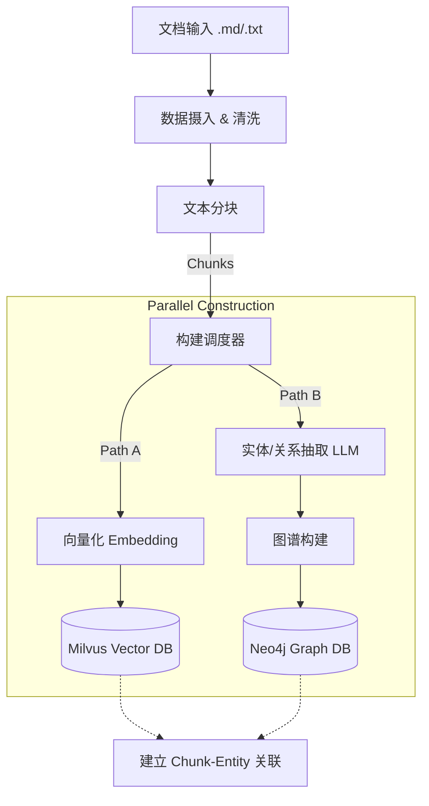
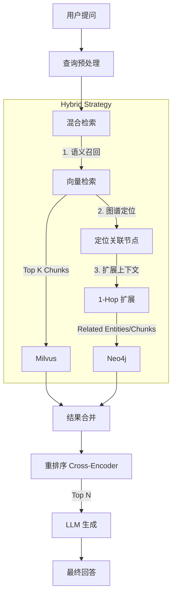

# GraphRAG 技术架构与全流程分析报告

## 1. 项目概览

本项目实现了一个典型的 **Graph-RAG (图增强检索生成)** 系统，采用 **双流架构 (Dual-Pipeline)** 设计。它结合了向量数据库 (Milvus) 的语义检索能力和图数据库 (Neo4j) 的结构化关联能力，旨在解决传统 RAG 在处理复杂实体关系和跨文档推理时的局限性。

### 核心目录结构
- **`backend/service/`**: 业务编排层，负责协调各个 Core 模块。
- **`backend/core/indexing/`**: 索引构建核心逻辑（分块、图构建、向量化）。
- **`backend/core/retrieval/`**: 检索核心逻辑（混合检索、重排序、生成）。

---

## 2. Indexing Pipeline (索引构建流)

此流程负责将非结构化文档转化为结构化的向量索引和知识图谱。

### 流程图

### 详细步骤与代码映射

1.  **数据摄入 (Ingestion)**
    *   **入口**: [index_service.py](file:///e:/代码发布区/Graph-RAG/backend/service/index_service.py)
    *   **逻辑**: 处理文件上传，支持 `.txt`, `.md` 等格式。

2.  **文本分块 (Chunking)**
    *   **代码**: [content_split.py](file:///e:/代码发布区/Graph-RAG/backend/core/indexing/chunk/content_split.py)
    *   **逻辑**: 使用 `ChunkBuilder` 将文档切分为语义完整的片段 (默认 ~500 chars)。
    *   **输出**: `List[Chunk]`，每个 Chunk 包含 `chunk_id`, `content`, `source_file`。

3.  **向量存储 (Vector Storage)**
    *   **代码**: [graph_vector_construction.py](file:///e:/代码发布区/Graph-RAG/backend/core/indexing/graph_vector_construction.py) (函数 `build_vector`)
    *   **模型**: 使用 Embedding 模型 (如 BGE/OpenAI) 生成向量。
    *   **存储**: 存入 Milvus，字段包括 `vector`, `chunk_content`, `file_meta`。

4.  **图谱构建 (Graph Construction)**
    *   **代码**: [graph_vector_construction.py](file:///e:/代码发布区/Graph-RAG/backend/core/indexing/graph_vector_construction.py) (函数 `build_graph`)
    *   **实体抽取**: 调用 [build_entity_extract_chain.py](file:///e:/代码发布区/Graph-RAG/backend/core/indexing/build_entity_extract_chain.py) 利用 LLM 提取 `(Subject, Relation, Object)` 三元组。
    *   **入库逻辑**:
        - 创建 `Chunk` 节点。
        - 创建 `Entity` 节点。
        - 建立 `(Chunk)-[:CONTAINS]->(Entity)` 关系（**关键设计**）。
        - 建立 `(Entity)-[:RELATION]->(Entity)` 关系。

---

## 3. Retrieval Pipeline (检索增强流)

此流程负责在用户提问时，通过混合检索策略生成精准答案。

### 流程图

### 详细步骤与代码映射

1.  **混合检索 (Hybrid Search)**
    *   **核心类**: [graph_vector_search.py](file:///e:/代码发布区/Graph-RAG/backend/core/retrieval/search/graph_vector_search.py)
    *   **Vector Search**: 从 Milvus 召回 Top-K 相似 Chunk。
    *   **Graph Expansion**:
        - 根据召回 Chunk 的 ID，在 Neo4j 中找到对应节点。
        - 执行 Cypher 查询扩展邻居节点 (Neighbor Entities)，获取隐藏的上下文信息。

2.  **重排序 (Reranking)**
    *   **代码**: [rerank.py](file:///e:/代码发布区/Graph-RAG/backend/core/retrieval/rerank.py)
    *   **逻辑**: 使用 Cross-Encoder 模型对 `Query + Candidate Chunk` 对进行打分，过滤低相关性内容。

3.  **生成 (Generation)**
    *   **代码**: [generate.py](file:///e:/代码发布区/Graph-RAG/backend/core/retrieval/generate.py)
    *   **逻辑**: 组装 Prompt，将高分 Chunk 作为 Context，要求 LLM 生成带引用的回答。

---

## 4. 关键代码文件清单

| 模块 | 文件路径 | 核心职责 |
| :--- | :--- | :--- |
| **API 入口** | [`backend/main.py`](file:///e:/代码发布区/Graph-RAG/backend/main.py) | 服务入口，定义 REST API |
| **索引服务** | [`backend/service/index_service.py`](file:///e:/代码发布区/Graph-RAG/backend/service/index_service.py) | 索引流程总控 |
| **检索服务** | [`backend/service/retrieval_service.py`](file:///e:/代码发布区/Graph-RAG/backend/service/retrieval_service.py) | 检索流程总控 |
| **图构建** | [`backend/core/indexing/graph_vector_construction.py`](file:///e:/代码发布区/Graph-RAG/backend/core/indexing/graph_vector_construction.py) | 向量与图谱的同步写入逻辑 |
| **实体抽取** | [`backend/core/indexing/build_entity_extract_chain.py`](file:///e:/代码发布区/Graph-RAG/backend/core/indexing/build_entity_extract_chain.py) | 基于 LLM 的三元组抽取 |
| **混合检索** | [`backend/core/retrieval/search/graph_vector_search.py`](file:///e:/代码发布区/Graph-RAG/backend/core/retrieval/search/graph_vector_search.py) | 实现向量+图的联合检索算法 |
| **重排序** | [`backend/core/retrieval/rerank.py`](file:///e:/代码发布区/Graph-RAG/backend/core/retrieval/rerank.py) | 检索结果精排 |
